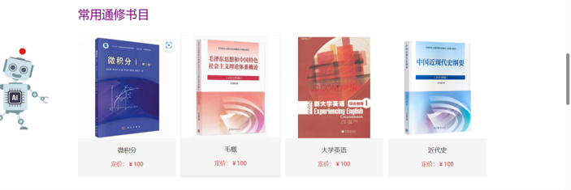
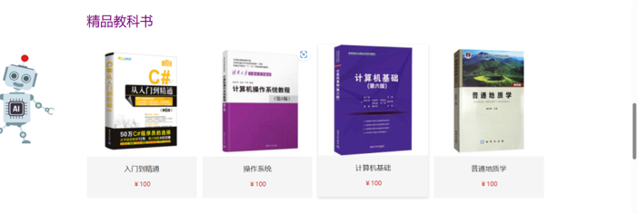

# N-Market
> A Campus Used Books Information Platform [First Prize of Jiangsu Province] [National Second Prize]
---
- [N-Market](#n-market)
   - [Motivation](#motivation)
   - [Architecture](#architecture)
   - [Demonstration of the work](#demonstration-of-the-work)
---

### Motivation

There is a lack of an intermediary platform with certain guarantees to enhance the efficiency of second-hand book transactions among students and the reliability of the items. Taking Nanjing University campus as an example, this platform aims to create an AI-powered transaction information platform. An AI assistant can provide personalized recommendation services such as book comparisons for customers, the transaction process is further constrained to improve efficiency, standardize the transaction process, and provide a comfortable experience for both parties

---
### Deployment

##### Prerequisite

- nginx nginx -s reload

##### Deploy backend

##### Deploy frontend
```bash
npm run serve
```


---
### Architecture
- Backend with Springboot
- Frontend with Vue3

---
### Demonstration of the work
You can try the [Live demo](http://124.71.159.90/home), powered by Huawei Cloud. (valid until 2023-08-15)

<details closed>
<summary>Homepage</summary>
<div align="center">





</div>
</details>


<details closed>
<summary>Login</summary>
<div align="center">

</div>
</details>


<details closed>
<summary>AI assistant</summary>
<div align="center">


</div>
</details>

<details closed>
<summary>Personal information & Edit</summary>
<div align="center">


</div>
</details>


<details closed>
<summary>Merchandise upload & Track</summary>
<div align="center">


</div>
</details>


<details closed>
<summary>Merchandise reserve</summary>
<div align="center">


</div>
</details>


<details closed>
<summary>Email notification</summary>
<div align="center">


</div>
</details>


---
Update time 2023-07-14
